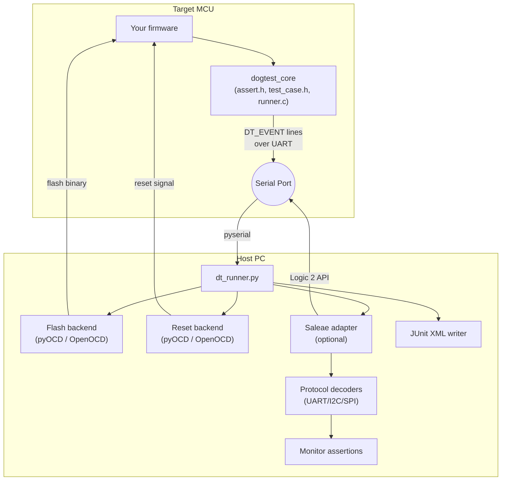

# Architecture

dog-test separates **target** and **host** concerns into two cooperating layers connected by a serial `DT_EVENT` protocol.

## Component Overview



## Layer Details

| Layer | Directory | Language | Purpose |
|---|---|---|---|
| Assertion library | `framework/` | C11 | Macros, test registration, event output |
| Host orchestrator | `tools/dt_runner.py` | Python | Flash, reset, serial capture, evaluation |
| Flash backends | `tools/backends/flash/` | Python | pyOCD and OpenOCD flash adapters |
| Reset backends | `tools/backends/reset/` | Python | pyOCD and OpenOCD reset adapters |
| Language adapters | `tools/backends/lang/` | Python | Rust build adapter (roadmap) |
| Logic capture | `tools/logic/saleae_adapter.py` | Python | Saleae Logic 2 automation |
| Protocol decoders | `tools/logic/decoders.py` | Python | Decode UART, I2C, SPI frames |
| Monitor assertions | `tools/logic/assertions.py` | Python | Evaluate `expect` blocks from specs |
| Monitor contracts | `tools/specs/monitor_contract.py` | Python | Parse JSON monitor specs |
| CMake helpers | `cmake/DogTest.cmake` | CMake | `dt_add_runner_test()`, `dt_add_plan_test()` |

## Execution Flow

### Single-test mode

1. **Build** — CMake compiles firmware + `dogtest_core` for the target.
2. **Flash** — The selected backend writes the binary to flash memory.
3. **Reset** — Reset policy applied (`none`, `soft`, or `hard`).
4. **(Optional) Logic capture** — Saleae begins recording on configured channels.
5. **Serial capture** — Host opens serial port and reads `DT_EVENT` lines.
6. **Parse** — `parse_dt_event_line()` extracts structured key-value data.
7. **Evaluate** — Pass/fail determined from `DT_EVENT summary` + monitor spec expectations.
8. **Report** — Exit code + optional JUnit XML.

### Suite-mode (test plans)

`--test-plan` accepts a JSON file listing multiple tests:

```json
{
  "tests": [
    { "name": "uart_test", "firmware": "path/to/binary", "reset_mode": "soft" },
    { "name": "i2c_test", "firmware": "path/to/binary", "reset_mode": "hard",
      "monitor": { "protocol": "uart", "channels": "ch0=tx", "trigger": "", "timeout_ms": 1200 } }
  ]
}
```

Each test entry is executed independently. `--reset-between-tests` forces a hardware reset before each entry, ensuring isolation for integration/system-test flows.

### Retry support

`--retries N` re-runs a failed test up to N additional times. This is useful for tests that are sensitive to timing or environmental noise. A test passes if **any** attempt succeeds.

## The DT_EVENT Protocol

All communication from target to host uses plain-text lines prefixed with `DT_EVENT`:

```
DT_EVENT boot
DT_EVENT start name=my_test reset=1 monitor=none
DT_EVENT pass name=my_test
DT_EVENT fail name=my_test reason=assert file=main.c line=17 expr="x == y" msg="expected x == y" expected=1 actual=2
DT_EVENT skip name=my_test reason="hardware not connected"
DT_EVENT summary total=5 passed=3 failed=1 skipped=1
```

Values containing spaces, `=`, or quotes are enclosed in double-quotes with backslash escaping. This makes the protocol language-neutral — any firmware that emits conforming lines can use the host runner.

## Future Rust Compatibility

See [Rust Roadmap](/en/reference/rust-roadmap) for details. The key constraint is that Rust test binaries must emit the same `DT_EVENT` protocol. The host runner requires no changes.
